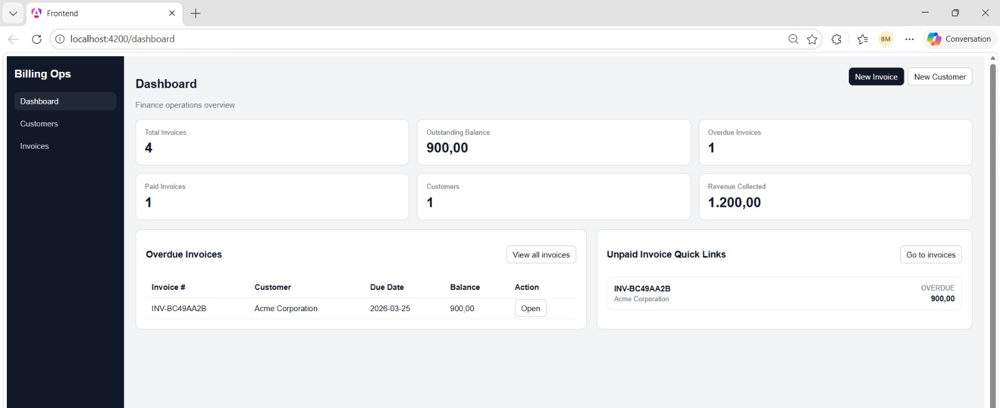
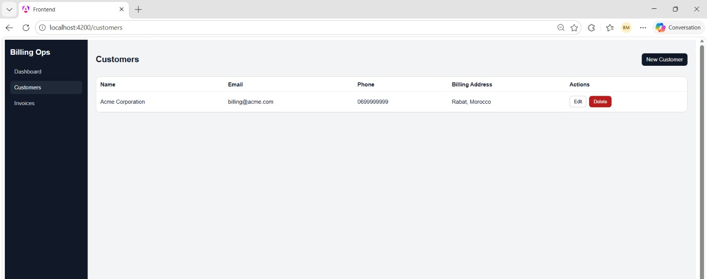
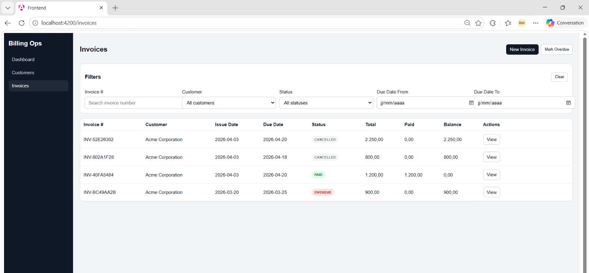
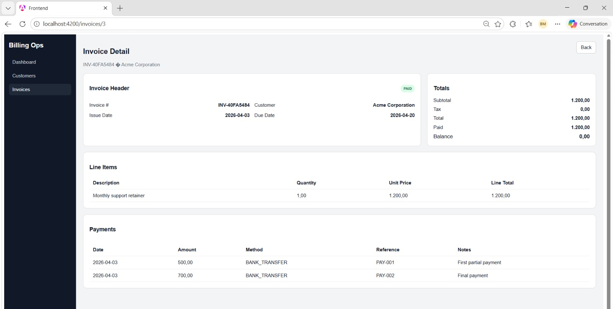
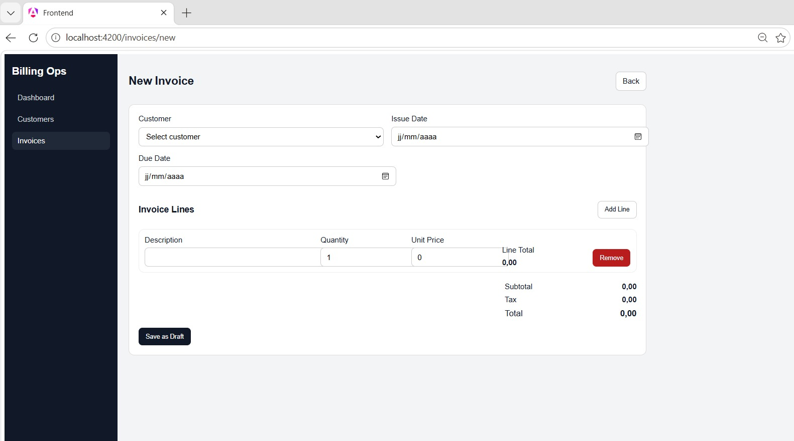

# Billing, Invoicing & Payment Reconciliation Platform

A full-stack finance operations platform for managing customers, invoices, payments, balances due, overdue tracking, and reconciliation-style workflows.

Built with **Spring Boot**, **Angular**, **PostgreSQL**, and **Docker**.

## Overview

This project simulates a lightweight internal finance operations tool used to manage:

* customers
* draft and issued invoices
* invoice line items
* partial and full payments
* overdue invoice marking
* dashboard-level finance visibility

It was built as a portfolio project to demonstrate real business software patterns beyond generic CRUD, including status transitions, money-related rules, balance tracking, and operational reporting.

## Tech Stack

### Backend

* Java 21
* Spring Boot
* Spring Web
* Spring Data JPA
* Bean Validation
* PostgreSQL
* Maven

### Frontend

* Angular
* TypeScript
* Reactive Forms
* Angular Router
* HttpClient

### Infrastructure

* Docker Compose
* PostgreSQL container

## Core Business Rules

The application enforces these rules:

* invoice total = sum of invoice lines
* balance due = total amount - payments applied
* only `DRAFT` invoices can be edited
* `DRAFT -> ISSUED`
* `DRAFT -> CANCELLED`
* `ISSUED -> CANCELLED` only if no payments were recorded
* `ISSUED -> PARTIALLY_PAID`
* `ISSUED -> PAID`
* `PARTIALLY_PAID -> PAID`
* `ISSUED -> OVERDUE`
* `PARTIALLY_PAID -> OVERDUE`
* payments cannot exceed the remaining balance due
* once fully paid, no further payments are allowed

## Invoice Statuses

The MVP uses these statuses:

* `DRAFT`
* `ISSUED`
* `PARTIALLY_PAID`
* `PAID`
* `OVERDUE`
* `CANCELLED`

## Features

### Backend

* Customer CRUD
* Draft invoice creation with multiple line items
* Invoice update while in draft state
* Invoice issue and cancel actions
* Payment recording
* Automatic paid / partially paid balance updates
* Overdue marking endpoint
* Dashboard summary endpoint

### Frontend

* Sidebar navigation shell
* Customer list and customer form
* Invoice list with status actions
* Invoice creation form with live totals
* Invoice detail page
* Payment section inside invoice detail
* Real dashboard page with summary cards and quick links
* Client-side invoice filters

## Current MVP Scope

Implemented and working:

* customer CRUD
* draft invoice creation
* invoice issue
* invoice cancel
* payment recording
* partial payment transition
* full payment transition
* overdue marking
* dashboard summary
* invoice detail page
* Dockerized PostgreSQL
* Angular frontend
* Spring Boot backend

## Screenshots

Add your screenshots here after exporting them into a `screenshots/` folder.

### Dashboard



### Customers



### Invoices



### Invoice Detail



### New Invoice



## Project Structure

```text
billing-reconciliation-platform/
├── backend/
└── frontend/
```

### Backend structure

```text
controller/
dto/
  customer/
  invoice/
  payment/
  dashboard/
entity/
enums/
exception/
repository/
service/
mapper/
```

## Getting Started

## 1. Clone the repository

```bash
git clone https://github.com/your-username/billing-reconciliation-platform.git
cd billing-reconciliation-platform
```

## 2. Start PostgreSQL with Docker

From the project root:

```bash
docker compose up -d
```

## 3. Backend configuration

The backend uses `application.properties` with PostgreSQL connection settings.

Example:

```properties
spring.application.name=billing-reconciliation-platform
spring.datasource.url=jdbc:postgresql://127.0.0.1:55432/billing_db
spring.datasource.username=postgres
spring.datasource.password=postgres
spring.jpa.hibernate.ddl-auto=update
spring.jpa.show-sql=true
spring.jpa.properties.hibernate.format_sql=true
server.port=8080
```

## 4. Run the backend

From `backend/`:

```bash
./mvnw spring-boot:run
```

On Windows PowerShell:

```powershell
.\mvnw spring-boot:run
```

Backend runs on:

```text
http://localhost:8080
```

## 5. Run the frontend

From `frontend/`:

```bash
npm install
npx ng serve -o --proxy-config src/proxy.conf.json
```

Frontend runs on:

```text
http://localhost:4200
```

## API Overview

### Customers

* `GET /api/customers`
* `GET /api/customers/{id}`
* `POST /api/customers`
* `PUT /api/customers/{id}`
* `DELETE /api/customers/{id}`

### Invoices

* `GET /api/invoices`
* `GET /api/invoices/{id}`
* `POST /api/invoices`
* `PUT /api/invoices/{id}`
* `PUT /api/invoices/{id}/status`
* `PUT /api/invoices/mark-overdue`

### Payments

* `GET /api/invoices/{id}/payments`
* `POST /api/invoices/{id}/payments`

### Dashboard

* `GET /api/dashboard/summary`

## Sample Workflow

1. Create a customer
2. Create a draft invoice with line items
3. Issue the invoice
4. Record a partial payment
5. Record the final payment
6. Watch the invoice status move from:

   * `DRAFT`
   * `ISSUED`
   * `PARTIALLY_PAID`
   * `PAID`

Or:

1. Create and issue an invoice with an old due date
2. Call mark overdue
3. Watch the invoice transition to `OVERDUE`

## Example Dashboard Metrics

The dashboard currently summarizes:

* total customers
* total invoices
* total paid invoices
* total overdue invoices
* total draft invoices
* total outstanding balance
* total revenue collected

## Frontend Routes

* `/dashboard`
* `/customers`
* `/customers/new`
* `/customers/:id/edit`
* `/invoices`
* `/invoices/new`
* `/invoices/:id`

## Filters Implemented

On the invoice list page:

* invoice number search
* customer filter
* status filter
* due date from
* due date to

## Why This Project Matters

This project adds a finance operations workflow to a broader portfolio of internal business software.

It demonstrates:

* business rule enforcement
* transactional thinking
* state-based workflow logic
* balance reconciliation behavior
* overdue / aging concepts
* reporting and dashboard design
* full-stack integration between Angular and Spring Boot

## Next Planned Improvements

Post-MVP improvements planned:

* PDF invoice generation
* CSV export
* bank statement import
* reconciliation screen
* scheduled overdue job
* role-based access
* audit trail
* credit notes
* email reminders

## Author

Built by Mountadem Badr as a portfolio project focused on finance operations workflows.
